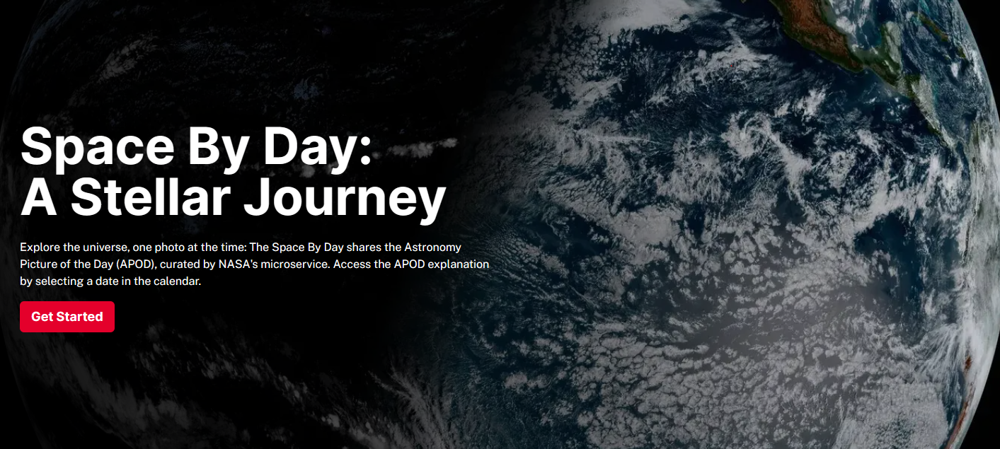

# The Space By Day🌌🚀👩🏼‍🚀

## Description

Explore the universe, one photo at the time: The Space By Day shares the Astronomy Picture of the Day
(APOD), curated by NASA's microservice. Access the APOD explanation by selecting a date in the calendar. This project results in a personal exercise for mastering performance and accessibility techniques in Next.js web apps with server side rendering.

## Project Structure

The project is divided into two main directories:

- `sbd-client`: Contains all the frontend code, built with Next.js and styled using Tailwind CSS🎨.
- `sbd-api`: Houses the backend code, which manages comments for photos and other server-side operations⚙️.

## Features

- **Monthly calendar**: Choose between multiple pictures of a day at first sight.
- **Navigate the 2024**: Use the navigator to move between January to December in 2024.
- **APOD detail**: Look for further explanation of the picture of a day in the detail page.
- **Comment on the photo**: Leave a comment and your thoughts on the picture of the day.

## Getting Started

To get the project up and running on your local machine, follow these steps:

### Prerequisites

- Node.js >= 18 installed
- A NASA's `APOD_API_KEY` (sign up for it at [NASA API portal](https://api.nasa.gov/index.html))

### Installation

**Note: preferably use `yarn`, since the project was bootstrapped with it (but you can also use npm)**

1. Clone the repository to your local machine.
2. Configure the enviroment variables. Navigate to the `sbd-client` directory and create a `.env` file in the root

```bash
cd sbd-client
```

3. Add your `APOD_API_KEY` and `API_URL`, as seen in the `.env.example` file
4. Navigate to the `sbd-api` directory and create a `.env` file in the root

```bash
cd sbd-api
```

5. Add your database and other variables beeded following the `.env.example` file
6. Navigate to the `sbd-client` directory and install the dependencies

```bash
cd sbd-client
yarn
```

7. Start the client development server:

```bash
yarn dev
```

8. In a separate terminal, navigate to the `sbd-api` directory and install the dependencies:

```bash
cd sbd-api
yarn
```

9. Start the development server:

```bash
yarn dev
```

<br />

Now, the platform should be running on your local environment, and you can begin exploring the universe!

<br />


